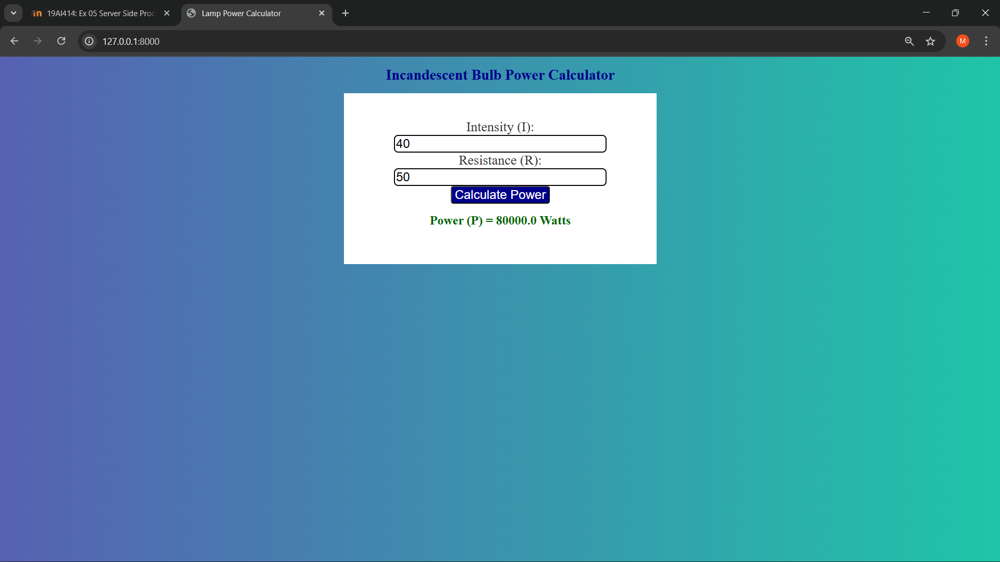

# Ex.05 Design a Website for Server Side Processing
# Date:01-10-2025
# AIM:
To design a website to calculate the power of a lamp filament in an incandescent bulb in the server side.

# FORMULA:
P = I2R
P --> Power (in watts)
 I --> Intensity
 R --> Resistance

# DESIGN STEPS:
## Step 1:
Clone the repository from GitHub.

## Step 2:
Create Django Admin project.

## Step 3:
Create a New App under the Django Admin project.

## Step 4:
Create python programs for views and urls to perform server side processing.

## Step 5:
Create a HTML file to implement form based input and output.

## Step 6:
Publish the website in the given URL.

# PROGRAM :
```
mohamed.html
<!DOCTYPE html>
<html>
<head>
    <title>Lamp Power Calculator</title>
    <style>
        body {
            background: linear-gradient(90deg,#5761B2, #1FC5A8); 
            
        }

        h1 {
            color: darkblue;
            font-size: 28px;
        }

        .container {
            background-color: #ffffff;  
            width: 500px;
            padding: 50px; 
        }

        label {
            font-size: 26px;
            color: #333333;
        }

        input {
            width: 80%;
            font-size: 24px;
            border-radius: 8px;
            border: 2px solid #080707;
        }

        button {
            font-size: 24px;
            background-color: darkblue;
            color: white;
            border-radius: 5px;
        }

        button:hover {
            background-color: navy;
        }

        h2 {
            color: darkgreen;
            font-size: 24px;
        }
    </style>
</head>
<body>
    <center>
    <h1>Incandescent Bulb Power Calculator</h1>

    <div class="container">
        <form method="POST">
            
            <label>Intensity (I):</label>
            <input type="number" name="intensity" required>

            <label>Resistance (R):</label>
            <input type="number" name="resistance" required>

            <button type="submit">Calculate Power</button>
        </form>

        
            <h2>Power (P) = {{ result }} Watts</h2>
        
    </div>
    </center>
</body>
</html>

views.py

from django.shortcuts import render

def azar(request):
    result = None
    if request.method == "POST":
        try:
            I = float(request.POST.get("intensity"))
            R = float(request.POST.get("resistance"))
            result = (I ** 2) * R
        except:
            result = "Invalid input"
    return render(request, "calc/mohamed.html", {"result": result})

urls.py

from django.contrib import admin
from django.urls import path
from calc import views

urlpatterns = [
    path('admin/', admin.site.urls),
    path('', views.azar, name='azar'),
]
```
# SERVER SIDE PROCESSING:

# HOMEPAGE:

# RESULT:



The program for performing server side processing is completed successfully.
